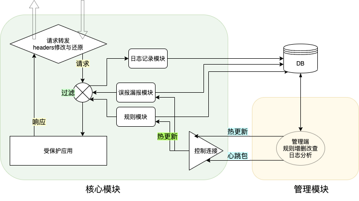

# WAF-Core
文档待会再写。



一个基于python原生socket的简单云WAF项目，可以根据正则定义的规则进行流量过滤和日志记录，支持漏报误报设置，并具有Web管理端。

所有的配置都写在`src/config.py`中

## 开发人员测试方法

### 部署到本地

首先clone项目

```
git clone https://github.com/RaidriarB/ByteDanceProject-WAF-core.git
cd ByteDanceProject-WAF-core
```

项目依赖于python虚拟环境，以下为配置方法

```
# 首次创建虚拟环境执行下面两条
python3 -m venv .venv
pip install -r requirements.txt


# 使用虚拟环境的话，每新开一个shell都要输入下面命令
# Mac/Linux下
source .venv/bin/activate
# Windows下
.venv/bin/activate.bat
```

启动核心

```
cd src
python main.py
```

同样要使用虚拟环境，启动Django

```
cd src_frontend
python manage.py runserver
```

然后访问`host:port`就可以了。如果没有更改`src/config.py`，访问`127.0.0.1:9999`为代理，`127.0.0.1:12345`是控制连接，`127.0.0.1:8000`是Django的测试服务器。

### 快速测试控制连接

使用ncat工具即可

```
nc 127.0.0.1 12345
# 然后发送
<-UPDATE->
# 或者发送心跳包
<-CONFIRM->
```

### 重要配置

```python
# 调试级别
# -1 自闭 不输出任何信息
# 0 包括白色正常信息全都输出
# 1 输出1级绿色debug及以上信息
# 2 只输出2级红色warning信息
DEBUG_LEVEL = 0

# 是否使用Django前端的数据库
# 根据数据库的不同，表名、列名也会有所不同
USE_DJANGO_DB = True

# 本地测试还是部署到服务器
# 会改变代理的端口、主机等信息
LOCAL_DEBUG = True

# 控制连接的监听端口
CONTROLLER_PORT = 12345
```


